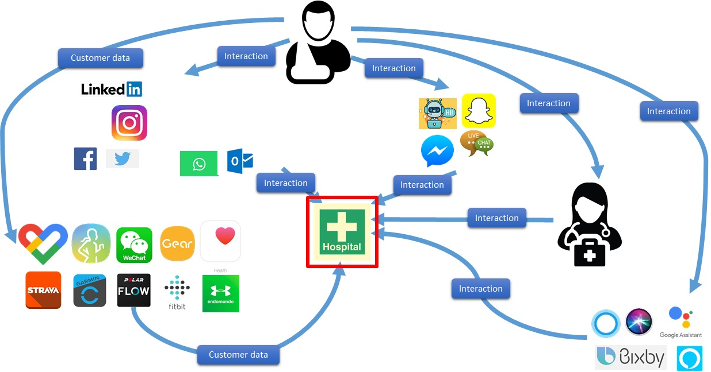

# DIDCom over XMPP
- Name: didcom-over-xmpp
- Author: Oskar van Deventer (oskar.vandeventer@tno.nl), Galit Rahim (galit.rahim@tno.nl), Alexander Blom (alexander.blom@bloqzone.com)
- Start Date: 2019-04-23
- PR: 
- Jira Issue: 

## Summary
[summary]: #summary

Firewalls are a major issue for peer-to-peer DID relationships. The DIDCom-over-XMPP feature provides an architecture to exchange DIDCom connection protocol messages over the XMPP chat protocol, bypassing any firewall issues.

DIDCom-over-XMPP enables, unburdened of any firwall issues:

- Initiation, use, maintenance and termination of a trusted electronic relationship
- DIDCom agents being available for incoming DIDCom messages
- Binding of that relationship to a human-to-human communication channel 

## Motivation
[motivation]: #motivation

Firewalls are a major issue for peer-to-peer DID relationships. All examples of service endpoint in the W3C DID specification use http. This assumes that the endpoint is running an http server and firewalls have been opened to pass this traffic. This assumption typically fails for smartphone DIDCom agents, as well as private internet connections of consumers and small busineses. As a consequence, such DIDCom agents are unavailable for incoming DIDCom messages, whereas several use cases require this.

*Use cases below still need to be updated with the firewall issue*

When a consumer contacts a business, then often identity proof is required during the conversation. For example, when a patient calls a health insurer, then the insurer can share any public information freely, like the insurance coverage of medical supplies for its various insurance products. However, the caller may next ask about its specific case, "does my current insurance cover a wheelchair". Before sharing such privacy-sensitive information with the caller, it needs to identify and authenticate the caller, and verify the caller's authorization to receive that information.

This identication and authentication is currently cumbersome. On the phone, the health insurer may ask for patient number, date-of-birth, maiden-name-of-mother, and more. Such checks take valuable call-center time and they are error-prone. Moreover, they are insufficient for some transactions, like the patient's commitment to pay for the other half of the wheelchair. In the latter case, the caller needs to contact the health insurer via another, more secure channel and explain the whole story again to a different person.

The problem is quickly getting worse, given the explosion of communication channels through which patients are contacting their health insurer. Phone, voice chat, text chat, video calls, Facebook chat, WhatsApp and Instagram are just some of the channels through which patient contact health insurers. Also all kinds of types and brands of personal health monitors are getting supported, each of which sends data to the health insurer that needs to be reliabily linked to the patient, and demonstrable authorization from the patient is needed before the health data can be collected, stored and used. Moreover, patients will be requisting information from the health insurer via virtual assistents like Amazon Alexa, Google Assistent, Apple Siri.



The above problem space applies to any sector with intensive consumer-to-business communication, including health services, energy service, telecommunication services, television services, internet services, tax office services, parcel services, emergency services, etcetera.

- The [DIDCom connection protocol](https://github.com/hyperledger/indy-hipe/tree/master/text/0031-connection-protocol) enables the setting up and maintenance of a trusted electronic relationship.
- The [XMPP protocol](https://en.wikipedia.org/wiki/XMPP) is a popular protocol for chat and messaging. Their combination is expected to be beneficial here.

The DIDCom-over-XMPP feature supports the following use cases.

- Use case 1: A new trusted electronic relationship is initiated during an electronic human-to-human communication.
- Use case 2a: An existing trusted electronic relationship is used during an electronic human-to-human communication to authenticate it.
- Use case 2b: An existing trusted electronic relationship is used to switch to another an electronic human-to-human communication without losing the call history.

## Tutorial
[tutorial]: #tutorial

The DIDCom-over-XMPP feature provides an architecture for the transport of DIDCom messages over an XMPP network.

### DIDCom

The DIDCom connection protocol is specified in [Hyperledger Indy Hipe 0031](https://github.com/hyperledger/indy-hipe/tree/master/text/0031-connection-protocol). The purpose of the protocol is to set up a trusted electronic relationship between two parties (natural person, legal person, ...). Technically, the trust relationship involves the following

- Univocal identification of the parties within the context of the relationship
- Secure exchange of keys to encrypt and verify messages between agents of the parties
- Secure exchange of service end points to be reachable at in the future

W3C specifies [Data Model and Syntaxes for Decentralized Identifiers (DIDs)](https://w3c-ccg.github.io/did-spec/). This specification introduces Decentralized Identifiers, DIDs, for identification. A DID can be resolved into a DID Document that contains the associated keys and service endpoints, see also W3C's [A Primer for Decentralized Identifiers](https://w3c-ccg.github.io/did-primer/). W3C provides a [DID Method Registry](https://w3c-ccg.github.io/did-method-registry/) for a complete list of all known DID Method specifications. Many of the DID methods use an unambiguous source of truth to resolve a DID Document, e.g. a well governed public blockchain. An exception is the [Peer DID method](https://dhh1128.github.io/peer-did-method-spec/index.html) that relies on the peers, i.e. parties in the trusted electronic relationship to maintain the DID Document.

The DIDCom connection protocol has several steps to create a trusted electronic relationship.
- Step 0: Invitation to Connect, an out-of-band (open) invitation to connect from the *invitor*
- Step 1: Connection Request, an encrypted request from the *invitee* to the *invitor* containg a pairwise DID and the associated DID Document
- Step 2: Connected Response, an encrypted response from the *invitor* to the *invitee* containg a pairwise DID and the associated DID Document
- Step 3: Trust building, any further verification steps and exchange of verifiable credentials to enhance the trust in the newly created electronic relationship. 

The result is a trusted electronic relationship with a DID pair and associated DID Documents, ready for use in transactions. The DIDCom connecton protocol also includes steps to read (get current DID Document from the other), update (e.g. key rotation) and delete.

### XMPP (Galit, please extend and change where needed)

Extensible Messaging and Presence Protocol (XMPP) is a communication protocol for message-oriented middleware based on XML (Extensible Markup Language). It enables the near-real-time exchange of structured yet extensible data between any two or more network entities. Designed to be extensible, the protocol has been used also for publish-subscribe systems, signalling for VoIP, video, file transfer, gaming, the Internet of Things applications such as the smart grid, and social networking services.

Unlike most instant messaging protocols, XMPP is defined in an open standard and uses an open systems approach of development and application, by which anyone may implement an XMPP service and interoperate with other organizations' implementations. Because XMPP is an open protocol, implementations can be developed using any software license and many server, client, and library implementations are distributed as free and open-source software. Numerous freeware and commercial software implementations also exist.

XMPP uses 3 types of messages:

Message Type	Description
PRESENSE	Inform listeners that agent is online
MESSAGE	Sending message to other agent
IQ MESSAGE	Asking for response from other agent

*more text as needed*


### DIDCom over XMPP (Galit, your section)

*text to be added*

#### Use of MESSAGE

The DIDCom JSON text is send as plaintext as XMPP MESSAGE, without any additional identifiers.

#### Service endpoint

The service end point of a DIDCom-over-XMPP service is derived from the XMPP address by preceding the domain part of the XMPP address with "did." and remove the resources part, i.e. the "/" and anything behind it. The reason for removing the resources part is that DIDCom messages are addressed to the person/entity associated with the DID, and not to any particular device. 

Here are some examples of this convention.

- xmpp:alice@foo.com
- xmpp:alice@foo.com/phone
--> xmpp:alice@did.foo.com

- xmpp:bob@bar.com
- xmpp:bob@bar.com/laptop
- xmpp:bob@bar.com/phone
 --> xmpp:bob@did.bar.com

Here is an example of the "service" property of a DID Document with an XMPP service endpoint. Note that there is no resource (like "/laptop") indicated. This means that the XMPP service may route the DIDCom-over-XMPP message to Bob's phone, laptop or both. This depends on the XMPP routing logic provided by the XMPP service, as configured by Bob. 

```
{
  "service": [{
    "id": "did:example:123456789abcdefghi;xmpp",
    "type": "XmppService",
    "serviceEndpoint": "xmpp:bob@did.bar.com"
  }]
}
```

#### ABNF

Here is a formal [ABNF](ftp://ftp.rfc-editor.org/in-notes/std/std68.txt) description of the XMPP service endpoint syntax.

```
xmmp-service-endpoint = "xmpp:" userpart "@did." domainpart
  userpart = 1\*CHAR
  domainpart = 1\*CHAR 1\*("." 1\*char)
  CHAR = %x01-7F
```

### Use cases (Galit, more details as needed, e.g. about identifiers)

Here are three use cases where DIDCom over XMPP is used

#### Use case 1: A new trusted electronic relationship is initiated during an electronic human-to-human communication

Patient Alice (*xmpp:alice@foo.com/phone*) is having an XMPP chat session with Bob (*xmpp:bob@bar.com/laptop*), an employee of the local hospital. At some point in time, Bob proposes to Alice to establish a trusted electronic communication channel for future use. Bob uses the popular marketing term for "DIDCom", which Alice recognizes and accepts. Next Bob sends Alice a DIDCom Invitation to Connect via the chat channel. After Alice has confirmed that she understands the instructions, they disconnect the chat session.

Following the instructions, Alice's agent creates a new XMPP service end point *xmpp:alice@did.foo.com/phone*. It sets up an XMPP chat session to the received address of Bob's agent, *xmpp:bob@did.bar.com/laptop*. The two agents perform the remainder of the DIDCom connection protocol to create a pairwise-DID-based trusted electronic communication channel.

#### Use case 2a: An existing trusted electronic relationship is used during an electronic human-to-human communication to authenticate it

Patient Alice is on the phone with Bob, an employee of the local hospital. At some point in time, Bob recogmizes that he needs to authenticate Alice. Bob sees that he already has a trusted electronic communication channel with Alice. Bob asks Alice to repeat a six-digit code that she is about to receive via the trusated communication channel. Next, Bob instructs his agent with XMPP service end point *xmpp:bob@did.bar.com/laptop*, to send a six-digit code to the XMPP service end point of Alice's agent, *xmpp:alice@did.foo.com/phone*. Alice's agent receives the 6-digit code and presents it to Alice. Alice reads it back to Bob, upon which Bob can share the privacy-sensitive information with Alice.

#### Use case 2b: An existing trusted electronic relationship is used to switch to another an electronic human-to-human communication without losing the call history

Patient Alice has a Facebook chat with Bob, an employee of the local hospital. At some point in time, Bob recogmizes that the information that he needs to share requires Alice to use a different, more secure communication channel. 

*Alexander, could you remind us how this use case would proceed?*

## Reference
[reference]: #reference

*text to be added*

Provide guidance for implementers, procedures to inform testing,
interface definitions, formal function prototypes, error codes,
diagrams, and other technical details that might be looked up.
Strive to guarantee that:

- Interactions with other features are clear.
- Implementation trajectory is well defined.
- Corner cases are dissected by example.

## Drawbacks
[drawbacks]: #drawbacks

*text to be added*

Why should we *not* do this?

## Rationale and alternatives
[alternatives]: #alternatives

*text to be added*

- Why is this design the best in the space of possible designs?
- What other designs have been considered and what is the rationale for not
choosing them?
- What is the impact of not doing this?

## Prior art
[prior-art]: #prior-art

*text to be added*

Discuss prior art, both the good and the bad, in relation to this proposal.
A few examples of what this can include are:

- Does this feature exist in other SSI ecosystems and what experience have
their community had?
- For other teams: What lessons can we learn from other attempts?
- Papers: Are there any published papers or great posts that discuss this?
If you have some relevant papers to refer to, this can serve as a more detailed
theoretical background.

This section is intended to encourage you as an author to think about the
lessons from other implementers, provide readers of your proposal with a
fuller picture. If there is no prior art, that is fine - your ideas are
interesting to us whether they are brand new or if they are an adaptation
from other communities.

Note that while precedent set by other communities is some motivation, it
does not on its own motivate an enhancement proposal here. Please also take
into consideration that Indy sometimes intentionally diverges from common
identity features.

## Unresolved questions
[unresolved]: #unresolved-questions

*text to be added*

- What parts of the design do you expect to resolve through the
enhancement proposal process before this gets merged?
- What parts of the design do you expect to resolve through the
implementation of this feature before stabilization?
- What related issues do you consider out of scope for this 
proposal that could be addressed in the future independently of the
solution that comes out of this doc?

## Security considerations
[security]: #security-considerations

*text to be added*